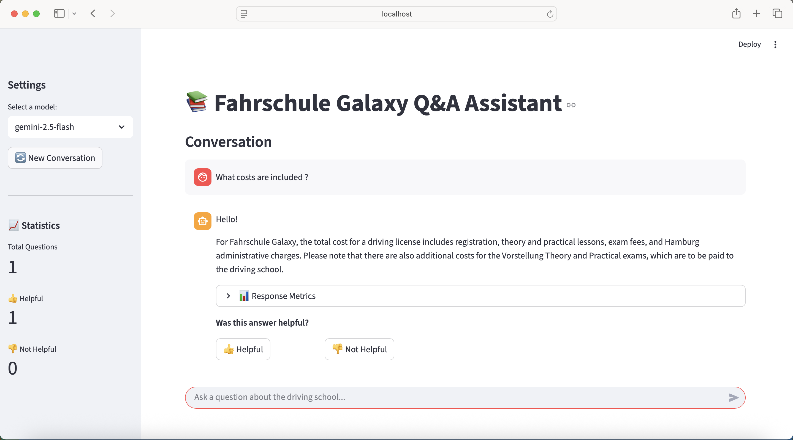

# 🚗 Fahrschule Galaxy - FAQ Assistant

An AI-powered FAQ chatbot for a driving school built with RAG (Retrieval-Augmented Generation), Streamlit, PostgreSQL, and Grafana monitoring.

<p align="center">
  
</p>

Learning about driving schools in Hamburg can be confusing, especially for new driving license learners. Many people aren’t sure about opening hours, application steps, required documents, or how to start their first lesson.

The Driving School FAQ Assistant provides a conversational AI that answers common questions—such as how to apply, course requirements, prices, and scheduling—making driving school information simple and accessible.

## Project overview

The Driving Assistant is a RAG application designed to assist
users with their queries.

The main use cases include:

1. General Information: Answering basic questions such as opening hours, contact details, and course schedules.
2. Application Guidance: Explaining how to apply, required documents, and the steps to enroll in a driving course.
3. Service Details: Providing information about driving lessons, theory classes, pricing, and exam procedures.
4. Conversational Support: Allowing users to quickly get answers without searching through long FAQs or websites.

## Dataset

The dataset is general faq's, generated by myself for a driving school named **Fahrschule Galaxy** in **Hamburg**. 
You can find the data in [`data/faq.csv`](data/data.csv).

## 🌟 Features

- **RAG-powered Q&A** - Retrieves relevant FAQ documents and generates accurate answers using Google Palm API
- **User Feedback** - Thumbs up/down buttons to collect feedback on answer quality
- **Persistent Storage** - All conversations and feedback stored in PostgreSQL
- **Analytics Dashboard** - Grafana dashboards for monitoring feedback statistics
- **Docker-based** - Full containerization with docker-compose for easy deployment
- **Multi-model Support** - Switch between gemini-2.5-flash and gemini-1.5-pro models

## 📋 Prerequisites

- Docker & Docker Compose
- Google API Key
- Python 3.11+ (for local development)

## Technologies

- Python 3.12
- Docker and Docker Compose for containerization
- Sentence Transformers for embeddings
- Chromadb for vector data storage 
- Streamlit for frontend UI
- Grafana for monitoring and PostgreSQL as the backend for it
- Google Palm as an LLM


## 🚀 Quick Start

### 1. Clone the Repository

```bash
git clone llm-RAG-DrivingSchoolAssistant.git
cd llm-RAG-DrivingSchoolAssistant
```

### 2. Set Up Environment Variables

Copy the example env file:

```bash
cp .env.example .env
```

Edit `.env` and add your Google API key:

### 3. Start All Services

```bash
docker-compose up --build
```

This will start:
- **Streamlit App** → http://localhost:8501
- **PostgreSQL** → localhost:5432
- **Grafana** → http://localhost:3000

<p align="center">
  
</p>

## 📁 Project Structure

```
.
├── app.py                          # Streamlit main application
├── rag.py                          # RAG pipeline logic
├── db.py                           # Database functions
├── ingest.py                       # FAQ data ingestion
├── Dockerfile                      # Streamlit 
├── docker-compose.yml              # Multi-container orchestration
├── requirements.txt                # Python dependencies
├── .env.example                    # Environment variables template
├── data/                           # FAQ data files
│   └── faq.json                    # FAQ documents
├── grafana/                        # Grafana configuration
│   └── provisioning/
│       ├── datasources/
│       │   └── postgres.yml        # PostgreSQL data source
│       └── dashboards/
│           ├── provider.yml        # Dashboard provider config
│           └── json/
│               └── faq-dashboard.json  # Main dashboard
└── README.md                       # This file
```

## 💻 Development

### Local Setup (without Docker)

```bash
# Create virtual environment
python -m venv venv
source venv/bin/activate  # On Windows: venv\Scripts\activate

# Install dependencies
pip install -r requirements.txt

# Set environment variables
export GOOGLE_API_KEY=your_key
export POSTGRES_HOST=localhost
# ... other env vars

# Run Streamlit
streamlit run app.py
```

### Running Tests

```bash
# Check database connection
pgcli -h localhost -U your_username -d dschool_assistant
```

## 📊 Monitoring with Grafana

The included Grafana dashboard shows:

- **Total Queries** - Number of FAQ questions asked
- **Total Feedback** - Number of feedback responses received
- **👍 Helpful** - Count of positive feedback (green threshold)
- **👎 Not Helpful** - Count of negative feedback (red threshold)
- **Queries by Relevance** - Distribution of answer quality

Dashboard auto-refreshes every 10 seconds.

### Accessing Dashboard Data via pgcli

```bash
pgcli -h localhost -U your_username -d dschool_assistant

# View all queries with feedback
SELECT rq.id, rq.question, f.feedback, f.timestamp
FROM rag_queries rq
LEFT JOIN feedback f ON rq.id = f.rag_query_id
ORDER BY rq.timestamp DESC;

# Feedback statistics
SELECT 
  SUM(CASE WHEN feedback > 0 THEN 1 ELSE 0 END) as thumbs_up,
  SUM(CASE WHEN feedback < 0 THEN 1 ELSE 0 END) as thumbs_down
FROM feedback;
```


## 🔑 Key Technologies

| Component | Technology |
|-----------|-----------|
| **Frontend** | Streamlit |
| **LLM** | Google Gemini API |
| **Vector Database** | Chroma DB |
| **Embeddings** | Sentence Transformers (all-MiniLM-L6-v2) |
| **Database** | PostgreSQL |
| **Monitoring** | Grafana |
| **Containerization** | Docker & Docker Compose |
